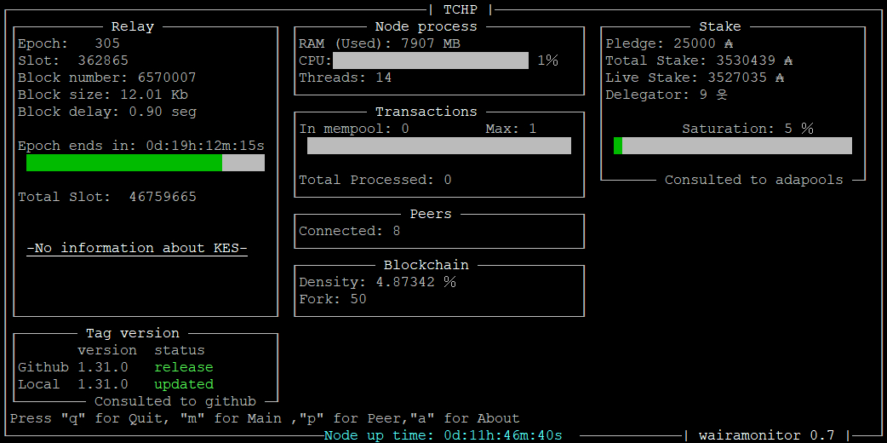
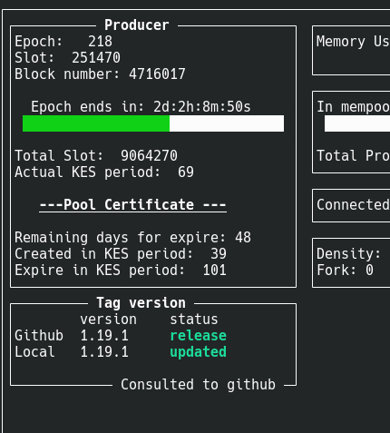

# Waira-monitor
*Relay mode*

*Node mode*

>Si hablas español lee el  [README_es](README_es.md) 

It is a tool created to monitor the new Haskell nodes (cardano-node). It is written in c ++ and uses ncurses for its graphical interface, so it can be viewed on any device that uses a terminal.
This monitor was born out of the need to have a dashboard without depending on external programs such as Grafana and thus can more easily access these statistical data with a light and simple interface.

Among the features offered by this monitor are:

* Check the versions of cardano-node on your server with the github repositories so you don't miss any updates.

* Make inquiries to adapools.org to see statistics of your pool, such as delegations, stake and saturation.

* You show the basic statistics of your node in operation, for example, the KES and thus do not forget to renew your keys.

## Compilation

You must first install the dependencies required to compile Waira-monitor.

    sudo apt install g++ make libncurses-dev libcurl4-openssl-dev

On some linux systems it gives an error when compiling ncursesw, in that case you must install this dependency.

    sudo apt install libncursesw5-dev

then download the most recent version from the reread tab, and unzip it in the directory you want, in that same directory you will now see a file called "Makefile" and a folder called "src".
Now in your terminal you must go to the directory where you unzipped the Waira-monitor and perform a make.

    make

This will generate a file called "wairamonitor".

you can run with:

    ./wairamonitor

> Waira-monitor uses a configuration file to adjust personal parameters, if this does not exist the same program will create one which you can edit later.

## Setting

Waira-monitor uses a configuration file so that you can more easily adjust the data of your monitor, this is in json format, to make it more user-friendly.

the configuration file is called "wairamonitor.conf", the program can create it automatically when it is not detected, once created you can edit it by completing the data you want.
the configuration file "wairamonitor.conf" obeys these settings.

    {
    "Directory_path": "",
    "Name": "MyPoolName",
    "Pool_id": "",
    "Prometheus_port": 12798,
    "Query_github":false,
    "Query_adapools":false
    }
   
* Directory_path: Corresponds to the path where your cardano-node and cardano-cli are located, for example "~/Relay/" and is used to compare your node version with that of the Github repositories, if it is left blank, It will only show the latest version of the cardano-node from Github.
* Name: It is the name that your monitor window will have.
* Pool_id: It is the id of your pool and it is used to make the queries to adapools.org, if you leave it blank or simply delete this configuration, the queries will not be made.
* Prometheus_port: Connect to your prometheus port of your cardano-node, by default it is always 12798.
* Query_github: Enable (true) or disable (false) queries to Github.
* Query_adapools: Enables (true) or disables (false) queries to adapools.org.
   
In the configuration file of your node "mainnet-config.json" you must set the "TraceBlockFetchDecisions" to "true" in this way you can view the statistics of the peers.

	"TraceBlockFetchDecisions": true,

In that same configuration file you will see the Prometheus and EKG port configurations.

	"hasEKG": 12788,
	"hasPrometheus": [
	"127.0.0.1",
	12798
	],

As you can see the port for Prometheus in this example, it is running by default on 12798.

## Execution
Once your configuration file is configured, you can leave your executable together with its configuration file wherever you want, then to run it you must have your terminal in the same path as your executable and do a:

    ./wairamonitor

***

