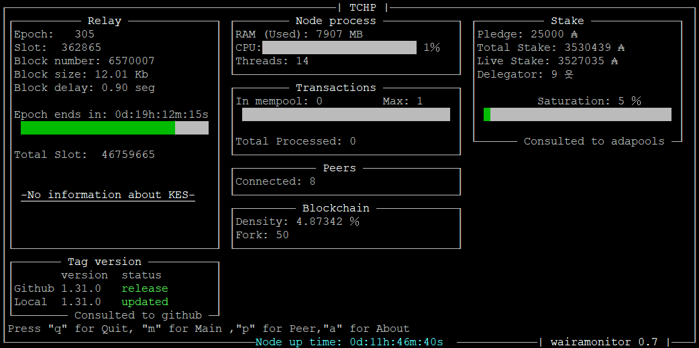
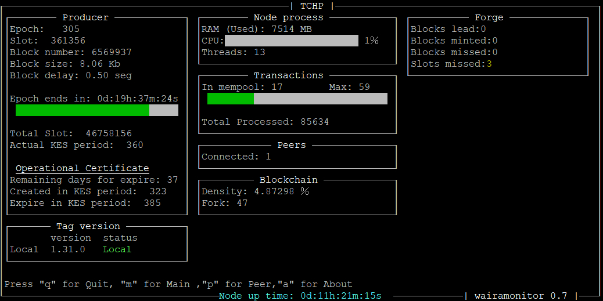

# Waira-monitor

*Modo Rele*

*Modo Nodo*

Es una herramienta, creada por Eztero operador de TricahuePool, para monitorizar los nuevos nodos Haskell (cardano-node). Esta escrita en c++ y usa ncurses para su interfaz gráfico, por lo que se puede visualizar en cualquier dispositivo que use una terminal.
Este monitor nació de la necesidad de tener un dashboard sin depender de programas externos como Grafana y así se pueda acceder más fácilmente a estos datos estadísticos con un interfaz liviano y simple.

Dentro de las características que ofrece este monitor, están:

* Comprueba las versiones de cardano-node de tu servidor con los repositorios de github para que no te pierdas ninguna actualización.

* Realiza consultas a adapools.org para ver estadísticas de tu pool, como delegaciones, stake y saturación.

* Muestras las estadísticas básicas de tu nodo en funcionamiento, por ejemplo, el KES y así no olvides renovar tus llaves. 

> Tengo pendiente en la próxima versión agregar la opción para visualizar los peers y las conexiones de red

## Compilación

Primero deberás instalar las dependencias requeridas para compilar Waira-monitor

	sudo apt install g++ make libncurses-dev libcurl4-openssl-dev

luego descarga la versión más reciente desde la pestaña reléase, y descomprímela en el directorio que desees, en ese mismo directorio ahora veras un archivo llamado "make" y una carpeta llamada "src”.
Ahora en tu terminal deberás ir al directorio donde descomprimiste el Waira-monitor y realizar un make.

	make

Esto generara un archivo llamado "wairamonitor"

puedes ejecutar con:

	./wairamonitor

>Waira-monitor usa un archivo de configuración para ajustar los parámetros personales, si este no existe el mismo programa creara uno el cual podrás editar después.

## Configuración

Waira-monitor usa un archivo de configuración para que puedas ajustar más fácilmente los datos de tu monitor, este está en formato json, para que sea más amigable para los usuarios.

el archivo de configuración se llama "wairamonitor.conf", el programa lo puede crear automáticamente cuando no lo detecta, una vez creado puedes editarlo completando los datos que desees.
el archivo de configuración "wairamonitor.conf" obedece a esta configuración.

	{
    	"Directory_path": "",
    	"Name": "MyPoolName",
    	"Pool_id": "",
    	"Prometheus_port": 12798
   	 }
   	 
   * Directory_path: Corresponde a la ruta donde se encuentra tu cardano-node y cardano-cli, por ejemplo "~/Rele/" y es usado para comparar tu versión de nodo con la de los repositorios de Github, si se deja en blanco, solo mostrara la última versión del cardano-node de Github.
   * Name: Es el nombre que tendrá la ventana de tu monitor.
   * Pool_id: Es la id de tu pool y se usa para realizar las consultas a adapools.org, si lo dejas en blanco o simplemente borras esta configuración, las consultas no se realizarán.
   * Prometheus_port: Conecta a tu puerto prometheus de tu cardano-node, por defecto siempre es el 12798.
   
## Ejecución
Una vez configurado tu archivo de configuración, puedes dejar tu ejecutable junto con su archivo de configuración donde desees, luego para ejecutarlo debes tener tu terminal en la misma ruta de tu ejecutable y hacer un:

	./wairamonitor
